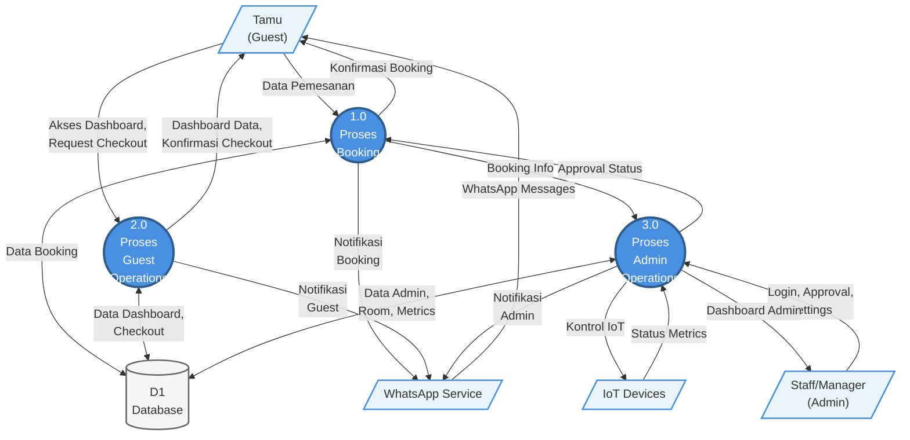

# Data Flow Diagram Level 1 - Sistem Innavance

## DFD Level 1 (Mermaid) - Simplified



---

```

---

## Penjelasan Singkat per Proses

### 1.0 Proses Booking
**Fungsi:** Mengelola pemesanan kamar dari awal hingga check-in

**Sub-proses internal:**
- Validasi dan pembuatan booking
- Persetujuan booking (manual/auto-approve)
- Generate Account ID untuk check-in

**Input:**
- Data pemesanan dari Tamu

**Output:**
- Konfirmasi booking ke Tamu
- Notifikasi WhatsApp (konfirmasi, approval, account ID)
- Booking info ke Admin Operations

**Data Store:** Database (Bookings, BookingsAddons, Rooms)

---

### 2.0 Proses Guest Operations
**Fungsi:** Operasional tamu setelah check-in

**Sub-proses internal:**
- Dashboard tamu (view data ruangan, metrics, notifikasi)
- Call innkeeper
- Self-checkout

**Input:**
- Permintaan akses dashboard dari Tamu
- Request checkout dari Tamu

**Output:**
- Dashboard data ke Tamu (room metrics real-time, booking info, notifications)
- Konfirmasi checkout
- Notifikasi WhatsApp (call innkeeper, checkout)

**Data Store:** Database (Rooms, Bookings, BookingsNotifications)

---

### 3.0 Proses Admin Operations
**Fungsi:** Manajemen sistem oleh staff/manager

**Sub-proses internal:**
- Autentikasi admin
- Approve/reject booking
- Force checkout
- Update settings
- Kelola user staff
- Monitoring & kontrol IoT
- Update metrics (cron job 5 detik)

**Input:**
- Login & action dari Admin
- Status metrics dari IoT Devices
- Booking info dari Proses Booking

**Output:**
- Dashboard admin (rooms, bookings, users, settings)
- Kontrol IoT (lock/unlock pintu)
- Approval status ke Proses Booking
- Notifikasi WhatsApp (admin actions)

**Data Store:** Database (Admin, AdminUsers, Rooms, Bookings)

---

## External Entities

| Entity | Deskripsi | Interaksi dengan Sistem |
|--------|-----------|-------------------------|
| **Tamu (Guest)** | Pelanggan yang memesan dan menginap | - Kirim data pemesanan<br/>- Akses dashboard ruangan<br/>- Request checkout<br/>- Terima notifikasi WhatsApp |
| **Staff/Manager (Admin)** | Pengelola sistem dan staff operasional | - Login dan autentikasi<br/>- Approve/reject booking<br/>- Force checkout<br/>- Kelola settings & user<br/>- Monitor dashboard admin |
| **IoT Devices** | Smart door, sensor listrik, sensor air | - Kirim status real-time ke sistem<br/>- Terima perintah lock/unlock |
| **WhatsApp Service** | Microservice eksternal (Baileys) | - Menerima request kirim notifikasi<br/>- Kirim WhatsApp ke tamu |

---

## Data Store

| ID | Nama | Deskripsi | Diakses oleh |
|----|------|-----------|--------------|
| **D1** | Database (MySQL) | Database utama sistem Innavance berisi semua tabel (Bookings, Rooms, Admin, dll) | Semua proses (1.0, 2.0, 3.0) |

**Tabel utama:**
- Bookings, BookingsAddons, BookingsNotifications
- Rooms, RoomsAddons, RoomsFeatures
- Admin, AdminUsers, AdminNotifications
- Addons

---

## Keunggulan DFD Level 1 yang Disederhanakan

✅ **Mudah dibaca** - Hanya 3 proses utama
✅ **Clear boundaries** - Jelas pemisahan fungsi guest vs admin
✅ **No cross lines** - Aliran data tidak bersilangan
✅ **Sesuai standar** - 7±2 rule (maksimal 9 proses)
✅ **Scalable** - Tiap proses bisa dipecah ke Level 2 jika perlu detail lebih

---

## Next Steps: Level 2 DFD (Opsional)

Jika butuh detail lebih, bisa buat **Level 2 DFD** untuk masing-masing proses:

- **DFD Level 2 - Proses 1.0 (Booking)** → detail: 1.1 Pemesanan, 1.2 Persetujuan, 1.3 Check-in
- **DFD Level 2 - Proses 2.0 (Guest Operations)** → detail: 2.1 Dashboard, 2.2 Call Innkeeper, 2.3 Checkout
- **DFD Level 2 - Proses 3.0 (Admin Operations)** → detail: 3.1 Authentication, 3.2 Booking Management, 3.3 Room Management, 3.4 Settings
