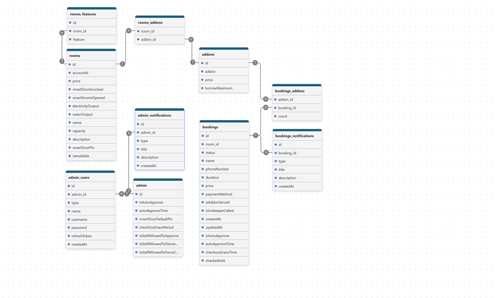
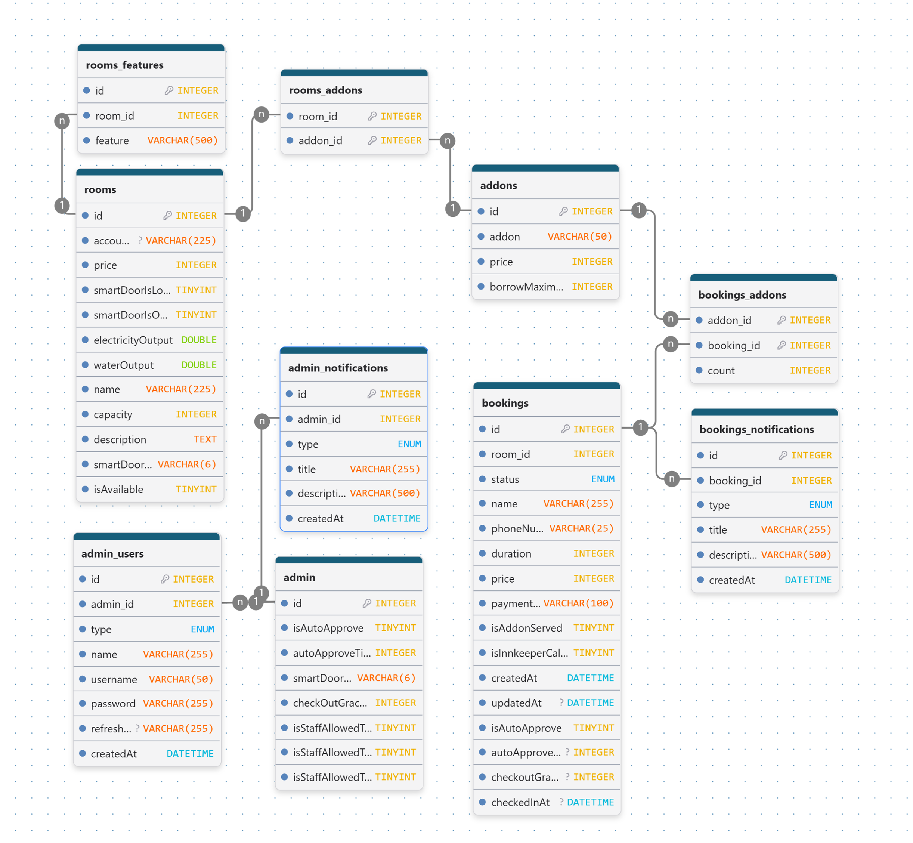

# Innavance \(Smart Boarding House\)

### Innavance is a smart boarding house\. leveraging IoT and digitalisation, Innavance brings you a streamlined and efficient way to serve and stay\.

**What is the difference between Innavance and an ordinary boarding house?**

Each space \(room\) in Innavance is built around IoT and one unified web interface, where you can view and monitor different aspects of their space, calling staff, checking out, and more\. Furthermore, we utilise WhatsApp to securely notify you about any crucial information, so you don't miss it\.

**How can I book one today?**

You can come to our structure, and browse all of the spaces we offer\. If you decide to book one of the spaces, simply follow the instructions display on the screen and scan the QR code\. Upon completing your booking, you should receive our message on WhatsApp that contains your booking information and further steps required\.

**How can I checkout?**

From the room dashboard, simply click the checkout button\. You should pack your bags before\. If not, we still give you a grace period for you to do stuff before leaving\. Be mindful that after the period ends, the door will lock automatically, if closed\. Then you can come to our desk to pay, and leave afterwards\.

**What if something happens after the grace period ends?**

In our web interface, simply click "contact admin" and explain your problems\.

## Manual Flowchart

[https://miro.com/app/board/uXjVHvSWJDM=/?moveToWidget=3458764682088203739&cot=14](https://miro.com/app/board/uXjVHvSWJDM=/?moveToWidget=3458764682088203739&cot=14)

**Specifically, What is The Innavance Web?**

Innavance Web is a system embedded in Innavance\. 

By leveraging a web app in our boarding house, we streamlined the process of the guest flow from arriving to leaving\. Also, it help staff to manage rooms, guest bookings, and more while keeping the data secure and minimising loss\. Lastly, by using our web app, you can monitor your rooms, call innkeeper, and check out from our place, all in one web interface\.

**How does Innavance Web help streamline the guest flow?**

In normal boarding house, you have to either come to the front\-desk and ask about any available rooms, retrieve the physical key, and then you finally can go to your room\. Or, sometimes you can book the room online, and you will still need to come to the frontdesk to retrieve the key\. 

Innavance solve this problem using the Innavance Web so that you no longer have to come to the front desk first\. You can enter our infrastructure, browse rooms, book, and you are good to go\. 

Payment is done after checking out, this time you have to go to the front desk and let the staff examine the booking and finalise your payment\.

**What is Innavance Web Made Of?**

Innavance Web is made of 4 services, that includes:

**Front\-end** This service is filled with the visual of the web app, allowing you to see the paragraph, images, and allow you to fill out the booking form\.

**Back\-end **Back\-end contains all the logic and is the one who received and sent your requested data\. Security measures are implemented in here to ensure your data stay safe\.

**Database **Database is the one who hold and manage data relations\.

**WhatsApp Service** This service is used to send you any crucial and important messages\.

**What are Innavance Web Services Made With?**

Innavance Web services is built around Javascript ecosystem\.

**Front\-end **This services is built with Typescript and leverage React with Vite for component reusability and massive ecosystem\.

**Back\-end** Back\-end is built with NestJS for dependency injection and modular design\.

**Database **We use MySQL database for data relation support\. Not only that, with the help of Typescript, we have the ability to use Prisma ORM that provide database modelling, data retrieving and data inserting while having full knowledge on what our database look like and the data inside without ever have to look manually\. 

## Context Diagram

[https://miro.com/app/board/uXjVHvSWJDM=/?moveToWidget=3458764682092464833&cot=14](https://miro.com/app/board/uXjVHvSWJDM=/?moveToWidget=3458764682092464833&cot=14)

## ER Diagram

[https://miro.com/app/board/uXjVHvSWJDM=/?moveToWidget=3458764682089112591&cot=14](https://miro.com/app/board/uXjVHvSWJDM=/?moveToWidget=3458764682089112591&cot=14)

 

## Conceptual Data Model

## Physical Data Model

